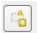

Introduction to GIS with QGIS
=============================

Stacey Maples – Geospatial Manager – Stanford Geospatial Center –
<stacemaples@stanford.edu>

David Medeiros – GIS Instruction & Support Specialist - Stanford Geospatial
Center - <davidmed@stanford.edu>

This introductory session will focus upon the fundamental concepts and skills
needed to begin using Geographic Information Systems software for the
exploration and analysis of spatial data using the QGIS platform.  Topics will
include:

-   What is GIS?

-   Spatial Data Models and Formats

-   Projections and Coordinate Systems

-   Basic Data Management

-   The QGIS User Interface

-   Simple Analysis using Visualization.

GIS Resources:
--------------

Stanford Geospatial Center website - <http://gis.stanford.edu/>

Stanford GIS Listserv -
<https://mailman.stanford.edu/mailman/listinfo/stanfordgis>

QGIS Current Version Download - 

QGIS Current Version Help - [https://qgis.org/en/docs/index.html](https://qgis.org/en/docs/index.html)

Download Tutorial Data
----------------------

1.  In a browser, go to <https://stanford.box.com/SGCIntroGIS> and click on the
    drop-down arrow to the right of each folder to download individual datasets.
    Save the Dataset to your Desktop.

2.  Right-click on the resulting **\*.zip** file and select Extract All…

3.  Accept all defaults to extract the data file.

Open QGIS and Explore the User Interface
----------------------------------------

QGIS (Quantum GIS) is a freen and open – source desktop geographic information
system (GIS) applocation. The first thing we want to do is **Open** QGIS and get
familiar with the Default User Interface.

1.  In Windows, go to the Programs menu and find the QGIS Pisa, then select QGIS
    Desktop 2.10.1

2.  You should be presented with the **New Document**. You should then be
    presented with something like the interface you see below:

### The Basic Components of the QGIS Interface

The QGIS interface is made up of three basic components:

**The Map Canvas** – This is where the raster and vector layers are displayed.

**Tabbed Windows**:

-   **The Browser Window –** Functions much as Explorer does in Windows. In this
    window, you can visualize your drives and folders. Is the equivalent of
    ArcCatalog in ArcMap.

-   **The Layers Window** – This is where your added geographic and
    non-geographic datasets will show. This is similar to the Table of Contents
    in ArcMap.

**General Menu Bars:**

-   **File Bar –** Has the basic commands of any file: New, Open, Save, Save As.
    The New Print Composer and Composer Manager are to create and manage layout
    views.

-   **Map Navigation –** Allows the user to Pan, Zoom to a Selected Feature,
    Zoom In, Zoom Out, Zoom to previous/next extent, and Refresh.

-   **Attributes –** These tools allow the user to: Identify attributes, Select
    / Deselect features, Opens attribute table, measure distance/areas/angles,
    create spatial bookmarks.

-   **Plugins –** QGIS comes with two default plugins: Python Console and QGis 2
    Leaflet Webmap.

-   **Help –** The question mark booklet is linked to the QGIS User Guide.

-   **Manage Layers –** This bar is to add layers (vector, raster, new shapefile
    layer)

Interacting with Tabbed Windows

1.  Move your cursor over the **Browser** dotted line. Click on the dotted line
    and drag the window to the bottom, below the **Layers** tabbed window.

### Explore the Browser

Using the **Window Explorer**, browse to the **\\Introduction\_to\_ArcGIS\\EX01\_World folder**, where you extracted the **EX01\_World.zip** file and
browse into the **EX01\_World\\Data** Folder.  

Note that, while there are 23 files in this folder, there are actually only 3
Shapefiles and a CSV Table here, as far as QGIS is concerned. This is because a
Shapefile isn’t really a *file* but a collection of files. *You* are looking at
this folder in Windows Explorer in order to illustrate a very important point
about many types of geographic data formats: Geographic datasets are often not
easily manageable using software not specifically designed for handling GIS
data. In the case of the Shapefile, for example, if you wish to rename or move a
shapefile, you must move or rename ALL of its component files in exactly the
same way, or you can corrupt the shapefile.

1.  **Return to QGIS** and use the **Browser Tabbed Window** to expand the Home
    Folder.

2.  **Expand** the **Home** and **Desktop** folder.

3.  **Expand** the **Introduction to QGIS**, and then **expand** the
    **Data** Folder.

Note that the Shapefile is much simplified in the Browser Window. Although the
Shapefile is still made up of several files, QGIS seems to know that it’s not a
good idea to make you deal with all that, so it simplifies things by only
showing you the .shp file.

### Finally, let’s open a Map Document!

You should, in addition to a Data Folder full of shapefiles, have a Map Document
in your **\\Introduction to QGIS\\** folder called…
**EX01\_World.qgs**. The icon looks like this:   

1.  **Drag** the **EX01_World.qgs Map Document** into the **Map Canvas** to open it.

### But Wait!

Has something gone awry? Do you see something that looks like this?

You are experiencing the dreaded “**Absolute Paths**” problem, endemic to GIS
Softwares. To fix this issue, do the following:

1.  **Press shift and click** to select all the layers.

2.  **Click the Browse** and browse to the **Data** folder
    and **select the folder**. Click OK.

You should find that (because they are all in the same ‘**workspace**') all of
your layers have been repaired and you should see something like the image on
the above (it's likely to look quite "sketchy").

### The Layers Tabbed window and its Properties 

Now take a look at the **Layers Tabbed Window**. You should 3 Layers
corresponding to the shapefiles in your Data Folder.

What you don’t see is that **CSV Table**. Look for the
**World\_Population\_2007** on the **Browser Panel**, select it and drag it to
the **Layers Panel.**

Note that the **World\_Population\_2007** table has been added to the Layers.

Notice how Asia almost disappears? **Right-Click** on the **Lat\_Long\_30** shapefile.
Select **Properties** and go to the **General Tab.** Under *Coordinate Reference
System* (CRS) notice that the selected CRS is WGS 84**.** If you click on it,
you will see that the Project CRS is **World\_Azimuthal\_Equidistant**. This
projection is useful for showing correct airline distances. So the layers in
this document are displayed using World Azimuthal Distance.

### Change the project Coordinate System. 

Close the **Layer Properties** and go to the **Project Tab** (Pull-down menu)
and select **Project Properties…**

1.  **Click** on the **CRS Tab**. 

2. **Filter and Select** “EPSG:4326 (WGS 84)”

2.  **Click** OK

3.  **Click Save**

What you have just done is reassigned the coordinate system of the **Map
Canvas** to that of the **Layers** in your **Map Document**. This (**GCS WGS
1984**) is actually the coordinate system of all of the layers in your **Map
Document**, so you should experience an increase in drawing performance, since
**QGIS** is no longer projecting these layers "on-the-fly" to the **World
Azimuthal Equidistant projection** (which was chosen for its extremity, in this
case). The result of this change should be a fairly substantial change to the
view on the Map Canvas.

### Change the Layer Coordinate System. 

Where are the cities?

1.  **Right Click** on the Cities Layer and **Zoom to Layer.** Notice how the
    cities are displayed.

2.  **Right click** on the Cities Layer and select **Layer Properties.** Notice
    how the coordinate system is not WGS. Change the coordinate system to
    **“**Project CRS EPSG:4326 (WGS 84)”

3.  **Click** OK

4.  **Click Save**

Explore Navigations Tools and Visibility in Data Frames
-------------------------------------------------------

Before we begin to explore the properties of individual layer in the Map
Document, we will first spend some time getting familiar with the navigation
tools in ArcMap. Most of these tools can be found on the “Tools” toolbar, though
some of the more useful ones involve right-click context menus of the layers.

### Zoom to Layer

1.  **Right-click** on the **Lat\_Lon\_30 Layer**, in the **Layers Window**, and
    select **Zoom to Layer**.

Note that this should present you with the entirety of the Lat_Lon_30 Layer’s
extent.

### Map Navigation Toolbar

The **Map Navigation Toolbar** provides the bulk of the tools for navigation in
the **Map Canvas**. Most of them are fairly obvious. Take a moment to explore
each of these tools, and how it works.

  The **Touch Zoom and Pan** - Works if you have a notebook with touch screen.
Zoom in and zoom out using double finger touch.

  The **Pan Map** changes the Extent of Map Canvas, without changing the scale.
Click on the Pan Tool and use it to move around the Map Canvas.

  The **Pan Map to Selection** changes the Extent of your Map Canvas to the
feature being selected, without changing the scale

  The **Zoom In Tool** and    **Zoom Out** works exactly as you would expect. Click on the Zoom Tool, and drag
a box to enclose the Continental United States. You can also single-click with
this tool to use it as a Fixed Zoom Tools.

  The **Zoom Full** zooms you to the full extent of the layer in your Map Project with the largest spatial extent. This can sometimes be problematic if you are
working at a local level, but using one or more layers that are global in extent
(for example, many of the network base map services).

  The **Zoom to Selection** changes the Extent of your Map Canvas and zooms in or
out to the selected feature.

### Scale

When zooming in or out, the Scale Values at the bottom page change. Remember
that the bigger the number (1:60,000,000), the larger the area being displayed.
Although 60,000,000 is bigger than 60, a scale 1:60,000,000 is a small scale and
1:60 is a large scale because the division of 1/60,000,000 is smaller than 1/60.

  The **Zoom to Layer** to a specific layer extent.

  The **Zoom Last** and  **Zoom Next** works as a Redo or Undo tool **ONLY** for the Scale/Extent in your Map Canvas. This tool is particularly useful if you change your Map Extent inadvertently.

  The **Refresh Button** will reload your Map Extent

### Bookmarks

One of the most useful navigation tools is the ability to create **spatial
Bookmarks**.  

**Right Click** on any grey area and select **Spatial Bookmarks.**

1.  Using the **Zoom Tools** on the **Tools Toolbar**, **Zoom** your **Data
    Frame** view to the **European/Asian Landmass**.
    
2. Go to the Spatial Bookmark Tabbed Window and **Click on Add Bookmark**   and name it **Europe & Asia**

 

3. **Click** on the **Zoom Full button** 

4.  **Go** to your **Spatial Bookmark** Window. **Select** “Europe & Asia” and
    **click** the **Zoom to bookmark**. You can also zoom to a bookmark by
    double- clicking on it.
    

Bookmarks can even be easily shared or moved from one using the Import/Export
tool Bookmarks, too. The bookmarks are saved as xml files that can be imported
into other QGIS projects. Bookmarks can also be deleted or edited on its name or
coordinates.

### Display Order

The Layer Order in the Layer Window determines the order of display in your Map
Canvas

1.  If you haven’t already, change your **Layers view, click and drag** the
    **Lat\_Lon\_30 layer** to the **top** of the **Layers Window**. Note that the
    other layers in your Map Canvas are now obscured.
    

## Working with Layers & Their Properties

### Layer Visibility

The Table of Contents also controls Layer Visibility. You can toggle the Layer
Visibility using the checkbox next to each Layer in the Layer Window.

1.  Use the **Visibility Checkbox** next to the **Lat_Long_30** Layer to **turn
    off** the **visibility** of the layer and reveal the other layers again.
    

### Examining and Selecting by Attributes

The most basic method of analysis in GIS is selection and sub-setting of data by
attribute values. Now that the Cities Layer is visible again, we can begin to
address the fact that this layer is a bit overpopulated for our purposes. Let’s
say we are interested in visualizing the global distribution of cities with
populations greater than or equal to 1 million. First we need to see if the data
necessary to do this exists in our dataset.

1.  **Right-Click** on the **Cities Layer** and select “**Open Attribute
    Table**” to open the **Attribute Table** of the layer.  
    
  

2. **Click and Drag** the resulting **Table Window** to the **bottom** of the **Map
Document** and expand the entire width of the Window.

1.  **Scroll** to the right until you can see the **POP, POP_RANK** and
    **POP_CLASS Attribute Fields**

2.  **Click** on the **POP Field Header** and select **Sort Descending** (Arrow
    Down)**.**

3.  **Scroll** down through the **Attribute table** to examine the relationship
    between these three variables.

### Selecting By Expression

What we would like to do is select all of the cities in this dataset that have a
population of 1 million or greater. This can be accomplished using any one of
these three of these variables, but we will use the POP_RANK variable for the
sake of simplicity.

1. On the Upper left corner of the Attribute Table, **find** the **Select by
Expression button**  and **click** on it.

1.  **Expand** Fields and Values, and **Double-click** on the “**POP_RANK**”

3. **Type \<= 2**

1.  **Click** the **Select button  and and Close.**

2.  **Scroll** through the Attribute Table and note the records that are
    selected.

3.  You can **observe that the selection from the Attribute Table is also
    reflected in the Map Canvas.**  
    

### Exporting Data

Notice that the Selection looks more manageable that the full dataset. Now you
will export this selection as a new shapefile, and bring it back into QGIS as a
new Layer.

**Right-click** on the **Cities Layer** and select **Save As.**

1.  **Check** Save only selected features.

2.  **Click** on the **Browse Button** and Browse into the **Data Folder** to
    save the new shapefile as **Major_Cities.shp.**

    

3.  **Click Save** and **OK**.

4.  **Right-click** on the **original Cities Layer** and select **Remove**.

#### Change City Symbology

Now we have two classes of POP_RANK to work with, and would like to distinguish
them from one another, visually.

**Right-Click** on the new **Major_Cities Layer** and **Open** its
**Properties**

1.  **Click** on the **Style Tab** and **Select Categorized**

2.  On **Column,** select **POP_CLASS**

3.  Click on **Classify**

4.  **Double click** the point symbol.

5.  In the resulting Symbol Selector, select Color Black and change Size to 1
    for “**1,000,000 to 4,999,999**” item. Click OK

Using the same method, change the symbol for the “**5,000,000 and greater**”
item to Color Black with a size of 3 **points**.

1.  **Unchecked** the point with no value.

2.  **Click OK** to close the Layer Properties Window.

3.  **Click Save**

#### Label Cities

Another property of the layers in our Document that we might want to enable is
the labeling of features. This can be accomplished, based upon an attribute
value for each of the features. In many cases, this might be the name, or some
other identifying attribute of the feature, but in some cases it might be a
quantitative value associated with the features. It is even possible to use VB
Scripting to assemble labels from several attributes and text elements. In this
example, we will label only the cities with a POP_RANK value of 1.

1.  **Right-Click** on the **Major_Cities Layer** and select **Layer
    Properties**.

2.  **Click** on the **Labels Tab.**

3.  **Check** the **Label this layer with** to enable options and **Select**
    CITY_NAME and Click **Ok.**

Note that this turns on labels for all features and. Because there are so many
visible features in this layer, this creates an unreadable labeling scheme. To
remedy this, we will limit labeling to the largest cities in the Major Cities
Layer.

**Right-click** on the **Major_Cities Layer** and select **Properties**. Go to
the **Labels Tab** and **Click** on **Rendering**.

1.  **Click** on the **Show Label** icon and **Select Edit** to open the
    Expression string builder window.

2.  **Expand** Fields and Values and **Double Click** on POP_RANK.

3.  In the **SQL Query** window, create a **SELECT argument** as follows:  
    **“POP_RANK”=1**

4.  **Click OK**

5.  **Go** to the TEXT Tab and c**hange** the **Label Size** to **7 points** and
    **Click OK** to apply this labeling scheme to the Data Frame.

### Definition Queries

1.  **Right-click** the **World\_ Countries dbf** and open the **Attribute
    Table.**

>   You may have noticed that many of the features in the
>   World_Population_2007.dbf file had values of **-99999** for the POP2007
>   attribute. This normally indicates **NODATA** for the particular feature in
>   demographic datasets. In this case, we would like to exclude this value from
>   our Map Document. We could use the method used to subset the Cities layer
>   earlier in the tutorial, but this time we will use another method called
>   Definition Query. Definition Queries “define” a dataset, based upon a SQL
>   Query, like the ones we have used to create the selection by attributes and
>   the labeling class. In this case, the Definition Query “defines” a subset of
>   the data layer that QGIS treats as the entirety of the dataset. It does not,
>   however, require creating a new dataset (preventing redundancy in data
>   storage) and does not alter the dataset being referenced, only our view of
>   it in QGIS.

1.  **Close the World_Countries** Attribute Table.

2.  **Right-click** the **World_Population_2007.dbf** and open the **Properties
    Window**.

3.  **Go** to the General Tab and **Click** on the **Query Builder button** at
    the bottom right**.**

On the Query Builder window create an **Expression** as follows:  
**"POP2007" \< \> -99999**

1.  **Click OK twice** to **apply** the **Definition Query**.

**Click the Refresh button. Open** the **Attribute Table** for the
**World_Population_2007 Layer** *and notice how the POP2007 Field no longer
contains records with -99999 as a value.*

### Join a Table to a Layer 

Now we will turn our attention to the World_Countries Layer. Ultimately, we
would like to visualize the layer based upon population density. However, the
attribute table for this layer doesn’t contain data on population. Fortunately
we have a table in our Map Document with the necessary population attribute.

1.  **Right-click** on the **World_Population_2007 Table** and select **Open**.

2.  Scroll through the attributes and note the **FIPS_CNTRY** Attribute Field.

3.  **Open** the **Attribute Table** for the **World_Countries Layer** and note
    that it also has a **FIPS_CNTRY** Attribute Field.

>   Since this attribute exists in both of these attribute tables, and its
>   values are identical across the two datasets, we can use this attribute as
>   the “**Key Field**” for our table join.

1.  **Close** the **Attribute Table** for the **World_Countries Layer.**

**Right Click** on the **World_Countries Layer** and **Select Properties**

1.  **Go** to the **Joins Tab** and **Click the Green Plus Sign** to open the
    **Add vector join** window.

2.  **Select World_Population_2007** as the **Join layer** and **FIPS_CNTRY**
    for the **Join** & **Target** fields.

3.  **Click OK** to close the Window and **Apply** to create the Join.

4.  **Close** the **Layer Properties Window** and **Open** the **Attribute
    Table** for the **World_Countries Layer** and note the **POP2007 Attribute
    (along with all other attributes from the World_Population_2007 table).**

    Some values are NULL because they were dropped

    when we perform the definition query.

#### Symbolize Countries by Population Density

We can now use the POP2007 attribute to visualize population density. Even
though the POP2007 variable is a raw counts variable, we can use the Style Tabs
Normalization capability to divide the POP2007 variable by the area of the
features to create the density value on-the-fly.

**Open** the **Properties** for the **World_Countries Layer** and click on the
**Style Tab**.

1.  **Select Graduated** and **click** the Expression Dialog button.

    

2.  **Expand** the **Fields and Values** and **double click** on the fields to
    **write** the normalization expression:

    "World_Population_2007_POP2007" / "SQMI" and **Click OK.**

3.  **Select Quantiles** as the classification mode and with **5 Classes**.

4.  **Click OK**.

5.  **Select** a **Color Ramp** and **Click OK** to **apply** the **Symbology**.

6.  **Uncheck** the Lat_Long_30 shapefile

*Note: When selecting your color ramp, be careful about selecting anything other
than monochrome color ramps. This is because you want your map to “read well” in
grayscale. In some of the 2-3 color ramps, the Intensity value of the colors at
each end of the spectrum is the same, so that they produce identical grayscale
values when converted, Xeroxed or printed in black & white.*

[media/image50.png](media/image50.png)
--------------------------------------

Print Composer

1.  **Click** on **New Print Composer**

    

    and name it **World_Population07. Click** OK.

>   Note that a new window opens. Take a moment to **explore** the **Composer
>   toolbar**

1.  **Click** the Add a new map icon

    and place the mouse pointer over the blank sheet. Notice a crosshair
    pointer. **Click and hold** on the left corner of the page and extend to the
    bottom right to draw a bounding box.

The Page Orientation and Size can be changed using the composition tab.

**Click** on the **Map Box** to select the item.

1.  **Go** to the **Item Properties Tab** and expand **Position and Size.** Set
    the **Map Size** as **10 in wide by 7 in (254 by 178 mm)**.

**Click** on the **Frame Tab** and set the **Border weight** to **.50mm
points**.

1.  On the **QGIS Map Canvas**, go to **Bookmarks** and zoom to your **Europe &
    Asia** bookmark.

Go to the map composer \> Item Properties \> Extents and **Click** View extent
in map canvas. To pan inside the map element **click** the **Move Item content**
icon and pan inside the map.

1.  **Check** the Background option and select a light blue as color background

### Adding Map Elements

#### [media/image56.png](media/image56.png)

Legend

**Click the Add new legend** and draw a bounding box inside the map.

1.  On the Legend items **click the Filter by content** icon.

2.  Expand the Spacing Tab and set the box space to 5.0 mm.

Give the **Legend** a **Border** of .50 mm and **Background** (white is a good
choice).

**Click Next\>** to **accept all remaining default settings** and insert the
Legend.

1.  Use the **Select move item tool** to **reposition** the **Legend**

2.  **Go** back to the Map Document and **Open** the layer properties. **Rename
    the layer Major_Cities to** “**Major Cities**” removing the underscore, and
    **click Ok** to commit the change.

3.  **Go** to the map composer and click the **Refresh** button.

>   *Note that the change you have made to the name of the Layer is also
>   reflected in the Legend*.

1.  Make changes to the other Text Elements of your Layers so that your Legend
    contains properly formatted and reasonable text descriptions and labels.

#### [media/image60.png](media/image60.png)

Scale Bar

1.  **Click** the Add new bar scale tool

2.  On the Item properties change the **Style** to Line Ticks Up.

3.  Change the Units to Feet.

4.  Set the **Segments** left 0 and right 2

5.  Use the **Select Elements Tool** to **resize** and **reposition** the
    **Scale Bar**.

#### [media/image61.png](media/image61.png)

Neat Line

1.  **Click** the Add figure and **select** add a rectangle.

2.  Be sure to draw it around all elements.

3.  Go to its Item properties and change the style to transparent fill and
    border width 0.50.

4.  **Click OK** to add the **neatline**.

Exporting Your Map
------------------

**Save your Map Composer**.

1.  **Click** on the **Export as Image Button.**

2.  **Save as type** to **PNG(\*.png)** and name it **EX01_World**

3.  **Click Save**.

4.  **Browse** to the Workshop Folder and double click on the **EX01_World.png**
    file to view it in the default image viewer.

